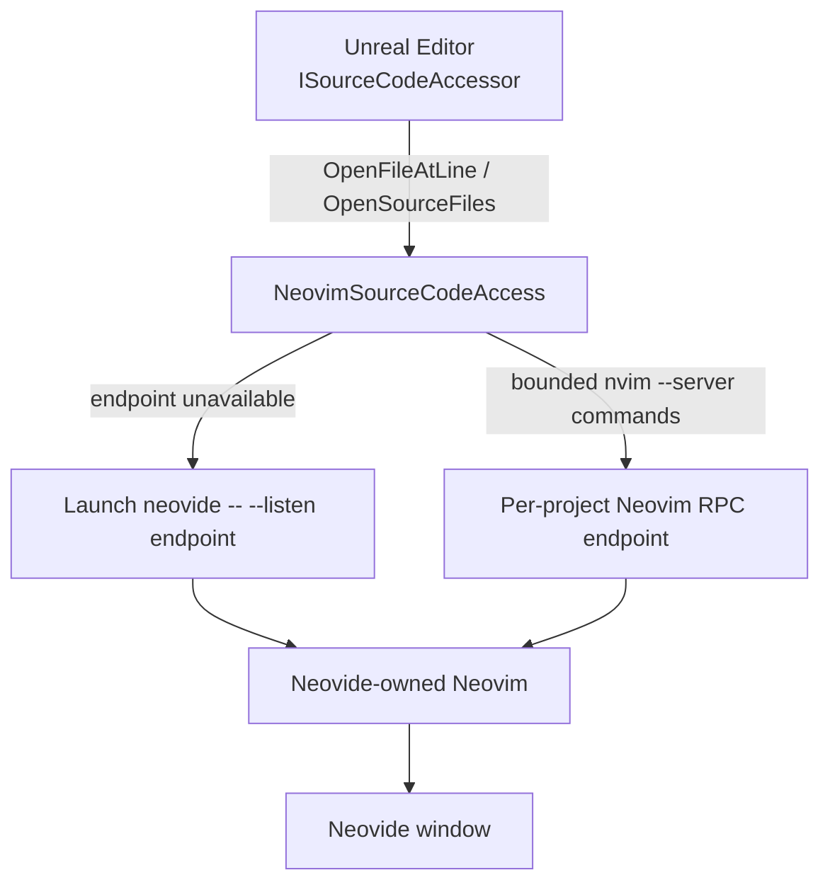

# NeovimSourceCodeAccess

NeovimSourceCodeAccess is an Unreal Engine Source Code Access plugin that opens C++ source files in Neovim. Its primary workflow uses [Neovide](https://neovide.dev/) as the GUI and reuses the Neovim instance embedded in that Neovide window through a project-specific RPC endpoint.

The plugin does not contact or launch Neovim or Neovide while Unreal Editor is starting. Editor discovery, RPC probing, and process launching begin only after Unreal requests that source code be opened.

## Features

- Registers `Neovim` as an Unreal Source Code Access provider.
- Opens source files at the line and column supplied by Unreal.
- Opens multiple source files through the same request path without recursive retries.
- Reuses a Neovide-backed Neovim instance that is listening on this project's known RPC endpoint.
- Launches Neovide automatically when that endpoint is not available.
- Uses a deterministic endpoint per Unreal project, allowing different projects to use different Neovide instances.
- Performs editor interaction on a background worker and applies finite timeouts to Neovim client processes.
- Implements endpoint paths for Linux, Windows, and macOS.

`OpenSolution()` and automatic saving of all open Neovim documents are not implemented.

## Requirements

- An Unreal Engine source or installed build capable of compiling project plugins and providing the `SourceCodeAccess` module.
- A C++ Unreal project and the platform toolchain required by that Unreal version.
- `nvim` available on the Unreal Editor process's `PATH`.
- Neovide available on `PATH`, or its absolute executable path configured in the plugin settings.

The plugin descriptor does not pin an Unreal Engine version. It uses the current `ISourceCodeAccessor` interface, but this repository has not been runtime-tested against a specific Unreal release in its present environment.

No environment variable is required. On Linux, `XDG_RUNTIME_DIR` is used for the automatically generated socket when it is defined; otherwise the Unreal user-temporary directory is used.

## Installation

### Project installation

Copy the repository directory to:

```text
<Project>/Plugins/NeovimSourceCodeAccess/
```

The directory should contain `NeovimSourceCodeAccess.uplugin` directly. Regenerate project files if required by your Unreal version, then build the editor target.

In Unreal Editor:

1. Open **Edit > Plugins**.
2. Find **Neovim Integration** in the Programming category.
3. Enable it and restart the editor if requested.
4. Open **Editor Preferences > Source Code** and select **Neovim** as the Source Code Editor. The exact preference name can vary between Unreal versions.

### Engine-wide installation

For an engine-wide source installation, the plugin may instead be placed under:

```text
<UnrealEngine>/Engine/Plugins/Developer/NeovimSourceCodeAccess/
```

Rebuild the appropriate editor target after installing it. A project-local installation is easier to version with a project and is the recommended approach.

## Neovide setup

No special manual Neovide command is required for the normal workflow. On the first source-open request, the plugin launches:

```text
neovide -- --listen <project-rpc-endpoint>
```

The `--` separator tells Neovide to forward the remaining arguments to the Neovim instance it launches. `--listen` therefore creates an RPC endpoint in the Neovim instance displayed by that Neovide window.

Neovide's own `--server <address>` option has different semantics: it connects Neovide to a server that already exists. It does not create the server used by this plugin.

For each open request, the plugin checks the endpoint with:

```text
nvim --server <project-rpc-endpoint> --remote-expr "1"
```

If the probe succeeds, the existing Neovide-backed instance is reused. If it fails, Neovide is launched and the plugin waits on its background worker, for a finite period, for the endpoint to become ready.

### Linux and macOS

The automatically generated endpoint has this form:

```text
$XDG_RUNTIME_DIR/neovide-unreal-<project-hash>.sock
```

If `XDG_RUNTIME_DIR` is unavailable, the socket is placed in Unreal's user-temporary directory.

To start a compatible Neovide manually, first configure **Neovide RPC address** to a known path, for example:

```text
/tmp/neovide-unreal-myproject.sock
```

Then launch:

```bash
neovide -- --listen /tmp/neovide-unreal-myproject.sock
```

A normally launched Neovide without `--listen` does not expose the project's expected endpoint and cannot be discovered by this plugin. The plugin deliberately does not use `pgrep` or process enumeration.

If a Unix socket remains after a crash and does not answer the RPC probe, the plugin removes it before launching the replacement Neovide instance.

### Windows

The automatic address is a per-project named pipe:

```text
//./pipe/neovide-unreal-<project-hash>
```

For a manually managed address, configure **Neovide RPC address**, for example:

```text
//./pipe/neovide-unreal-myproject
```

Then launch:

```powershell
neovide.exe -- --listen //./pipe/neovide-unreal-myproject
```

Windows named pipes disappear when their owning process exits, so there is no socket file to delete.

## Usage

The normal workflow is:

```text
Start Unreal Editor
        ↓
Work normally
        ↓
Use Open Source or navigate to C++ code/compiler output
        ↓
Unreal calls the Neovim source accessor
        ↓
Reuse the project's Neovide instance
        OR
Launch Neovide and establish the project RPC endpoint
```

`OpenFileAtLine()` converts the supplied path to an absolute path, opens it in the remote Neovim with `--remote`, and then evaluates `cursor(line,column)`. Unreal line and column values are treated as one-based; zero or negative values are clamped to `1`.

`OpenSourceFiles()` queues each supplied file through the same mechanism at line 1, column 1. Requests are serialized, so the first request may launch Neovide and following requests reuse the same endpoint.

The Neovim `--remote` operation uses `:drop`, which asks the remote editor to raise its UI. Whether the desktop permits focus stealing depends on the window manager or compositor.

## Configuration

Settings are available under **Editor Preferences > Plugins > Neovim**.

| Setting | Default | Purpose | When to change it |
|---|---|---|---|
| **Neovide executable** | `neovide` | Command name or absolute path used to launch Neovide. The plugin searches `PATH` when this is not an existing path. | Set an absolute path when Unreal's environment cannot find Neovide, such as `C:\Tools\Neovide\neovide.exe` or `/opt/homebrew/bin/neovide`. |
| **Neovide RPC address** | Empty | Overrides the generated per-project Unix socket or Windows named pipe. | Set this when manually launching Neovide, diagnosing RPC behavior, or requiring a fixed endpoint. Each simultaneously used project should have a distinct value. |

The previous `127.0.0.1:12345` remote URL and terminal-launch settings are no longer part of the plugin. Local sockets and named pipes avoid a fixed-port collision and avoid exposing an unauthenticated Neovim RPC server over TCP.

## Troubleshooting

### Unreal hangs during startup

Current startup code does not execute Neovim or Neovide and does not probe RPC. Startup should reach these messages:

```text
[NeovimSourceCodeAccess] StartupModule BEGIN
[NeovimSourceCodeAccess] Accessor Startup BEGIN
[NeovimSourceCodeAccess] Accessor Startup END
[NeovimSourceCodeAccess] Registering accessor BEGIN
[NeovimSourceCodeAccess] Registering accessor END
[NeovimSourceCodeAccess] StartupModule END
```

If startup still stops, inspect `Saved/Logs/<Project>.log` and include the last plugin message in a bug report. The relevant log categories are `LogNeovimSourceCodeAccessModule` and `LogNeovimCodeAccessor`.

### Unreal does not detect the accessor

1. Confirm the plugin is enabled in **Edit > Plugins**.
2. Confirm the editor target compiled the `NeovimSourceCodeAccess` module.
3. Search the project log for `StartupModule BEGIN` and `Registering accessor END`.
4. Select **Neovim** in the Source Code Editor preference.
5. Check that the current platform is included in the plugin descriptor: Win64, Linux, or Mac.

Accessor availability is intentionally optimistic so that Unreal can select it without launching external processes. Missing executables are reported when source is actually opened.

### Neovide does not open

Check from an environment equivalent to the one used to start Unreal:

```bash
command -v nvim
command -v neovide
neovide --version
nvim --version
```

On Windows:

```powershell
Get-Command nvim.exe
Get-Command neovide.exe
```

If Neovide is installed but absent from Unreal's `PATH`, set **Neovide executable** to its absolute path. Then inspect the log for `Cannot find Neovide executable`, `Launching Neovide`, or `endpoint did not become ready`.

### A new Neovide window opens every time

Reuse depends on the known Neovim RPC endpoint, not the existence of a `neovide` OS process. Check that:

- the existing Neovide was launched by the plugin or with `neovide -- --listen <same-address>`;
- **Neovide RPC address** has not changed;
- different projects are not intentionally using different per-project endpoints;
- `nvim --server <address> --remote-expr "1"` succeeds while the window is running.

If the probe fails, the plugin treats that window as unusable for this workflow and launches a new one.

### File opens but the line or column is wrong

The plugin calls `cursor(line,column)` after the file is opened. Both values are one-based, and values below 1 are clamped to 1. Neovim columns are byte-oriented for multibyte text, while compiler/editor column reporting may use a different convention.

Check the `OpenFileAtLine worker BEGIN` log, which includes the exact file, line, and column received from Unreal.

### Stale RPC socket or pipe

On Linux and macOS, a failed RPC probe followed by a launch attempt removes the known socket path before starting Neovide. If recovery still fails, close Unreal and Neovide, then remove only the configured or logged `neovide-unreal-*.sock` endpoint.

Windows named pipes have no persistent filesystem entry and normally disappear with the owning process. A failed pipe connection causes the plugin to launch Neovide and poll for a replacement endpoint.

## Debugging

The plugin uses these Unreal log categories:

- `LogNeovimSourceCodeAccessModule`
- `LogNeovimCodeAccessor`

They can be enabled from the Unreal console or command line, for example:

```text
-LogCmds="LogNeovimSourceCodeAccessModule VeryVerbose,LogNeovimCodeAccessor VeryVerbose"
```

Useful messages include:

```text
[NeovimSourceCodeAccess] StartupModule BEGIN
[NeovimSourceCodeAccess] StartupModule END
[NeovimSourceCodeAccess] OpenFileAtLine worker BEGIN (File=..., Line=..., Column=...)
[NeovimSourceCodeAccess] Launching Neovide (Executable=..., Server=...)
[NeovimSourceCodeAccess] OpenFileAtLine worker END (Success=true)
```

An open request without `Launching Neovide` reused the existing endpoint. Include the complete block from `OpenFileAtLine worker BEGIN` through its success/error message when filing an issue.

## Architecture



The central design rule is: **Unreal startup must never depend on a running Neovim or Neovide instance.** Endpoint probing and process launching happen only after a source-open request and outside the editor thread.

## Platform support

| Platform | Implementation | Test status | Endpoint |
|---|---|---|---|
| Linux | Implemented | Neovide/Neovim CLI syntax inspected locally; not runtime-tested inside Unreal | Unix-domain socket under `XDG_RUNTIME_DIR` or user temp |
| Windows | Implemented | Not runtime-tested | Named pipe under `//./pipe/` |
| macOS | Implemented | Not runtime-tested | Unix-domain socket under `XDG_RUNTIME_DIR` or user temp |

The plugin descriptor currently allows Win64, Linux, and Mac. Platform status above describes code paths in this repository, not a guarantee for every Unreal, Neovim, or Neovide version.

## Development

The module source is under `Source/NeovimSourceCodeAccess`. It depends on Unreal's `Core`, `CoreUObject`, `Engine`, `SourceCodeAccess`, `DesktopPlatform`, and `DeveloperSettings` modules.

For development:

1. Install the plugin into a C++ Unreal project.
2. Regenerate project files.
3. Build the project's editor target.
4. Start Unreal with the log categories above enabled.
5. Verify that startup reaches `StartupModule END` without launching Neovim or Neovide.
6. Trigger a source-open request and inspect the worker, launch, endpoint, and completion messages.

Run `git diff --check` before submitting changes. Test paths containing spaces, an already-running project Neovide, a missing Neovide executable, and recovery after killing Neovide.

## License

This repository currently does not contain a license file or license declaration. Do not assume permission to redistribute or modify the code beyond what applicable law permits; contact the repository owner for licensing terms.
